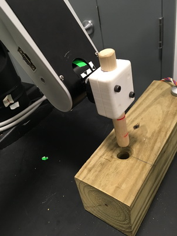
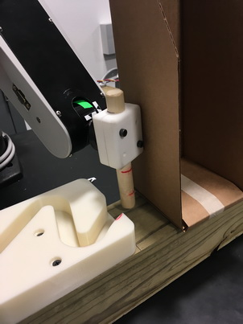
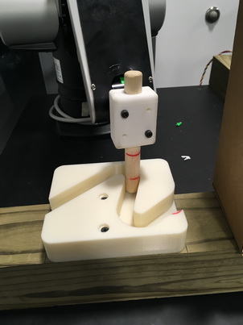
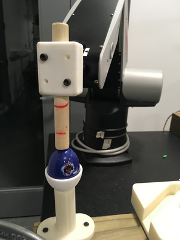
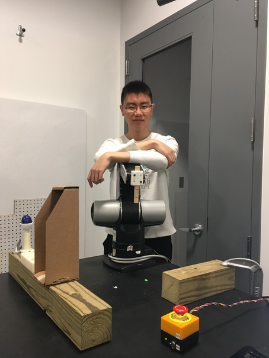
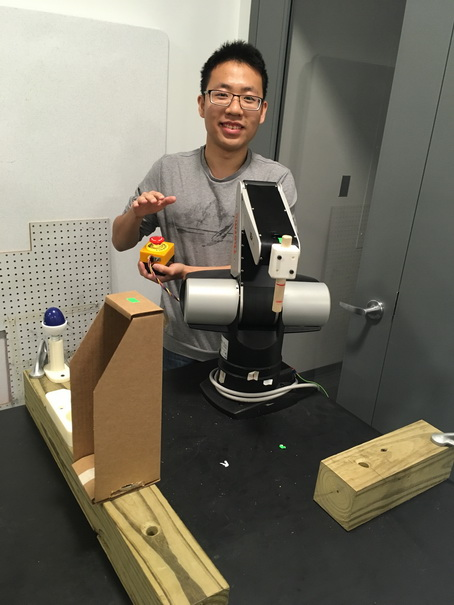

# ME 446/ECE 489 Robot Dynamics and Control
# Final Project Page

> By: **Diyu Yang**(dyang37) & **Dongbo Wang**(dwang49)

> Instructor: **Dan Block**

> Section: Sp17 Wed. 2~5 PM

## Demo Video

Below is our final project demo video using a real egg.

## Project Details

In the following sections, we will explain to you about our final project, including more details about the task, the control algorithms, the general strategy and things we learned from the course.

### Tasks

There are totally 4 tasks we need to complete for the project, as shown below.

   

1. **Peg in the Hole**

Insert the peg attached to the robot’s end effector in a hole that has tight   clearances.

2. **Avoid the Obstacle**

The robot’s end-effector has to reach the desired goal position without colliding with the obstacle.

3. **Zigzag Groove**

The peg on the end-effector has to pass through the narrow zigzag groove. 

4. **Egg Push**

Push the egg without cracking it and touch the edge of the egg holder.

### General Strategy

To complete the four tasks, we developed a general strategy of breaking the overall control into path planning and torque control. This is inspired by the task space control we learned in the last lab. Actually, this is an more intuitive strategy to control the robot, because for all the tasks, we could easily decide the start and end point and then even the entire trajectory we want to follow. After we agreed on the desired trajectory, we apply different force control to different trajectories depending on the actual scenario the robot is facing.

#### Path Planning

In the previous labs, we have developed a good control model to move the robot in straight lines in workspace. For the final project, it is clear that most of the trajectories are straight lines, like poking into the hole and pushing the egg. So we think it is a good idea to utilize that straight line control model we had.

Therefore, we perform the idea of linearization. In stead of some complex curves, we break down the entire trajectory into several small consecutive straight line segments, to approximate the ideal trajectory. Take the Zigzag for example, we break it down into seven parts, each into a straight line segment. During the break down process, we also tried to make the trajectory as smooth as possible by cutting at the point that has the largest curvature, like the middle of the turn, etc.

As a result, our final trajectory has a total of 17 straight line segments.

#### Control Algorithm

We first implemented friction compensation by doing a linear approximation between joint velocity and joint friction. We then add friction compensation to total torque so that the robot arm could move without friction when no external torque is added onto robot links.

The core control algorithm we used throughout the final project was a combination of task space PD control and impedance control. The task space PD control enables us to command the robotic arm to follow a strict straight line path, while the Impedance control allows us to weaken control gains along a certain direction so that the robot will have the ability to follow a complex path (like the zig-zag path shown in the video).

We finished the final project by dividing the robotic trajectory into small straight line pieces and program the robot so that it follows these straight line trajectories. We tuned our impedance control by performing coordinate transformation along desired trajectory direction, and weaken or tighten our PD gains along that direction according to the task we wish to accomplish.

### Things We Learned

There are certainly lots of things that we have learned in this course. The majority part includes two sections: robotic terminologies and control methods.

* **Robotic Terminologies**
>* DH Parameters and DH Frames
>* Forward Kinematics and Inverse Kinematics
>* Forward Dynamics and Inverse Dynamics

These are the basics of studying robotics. They teaches us how to represent robots structures into a general format of links and joints. Then, we could use standard procedures to determine the parameters of the links and joints. With these parameters, we could plug into math formulas to calculate the desired position or speed of the robot. 

* **Control Methods**
>* PD Control
>* PID Control
>* Feedforward Control
>* Inverse Dynamics Control
>* Impedance Control
>* Task Space PD Control

These are fundamental control methods that are extremely helpful in the labs and the final project. By comparing the performance, we learned the pros and cons of different control methods in different scenarios. The later ones like the task space control teaches as how to transform between the world coordinates and the task space coordinates so we could have a more targeted control over certain directions.

* **Lab Techniques**
>* Operating the Robot
>* Home Position Analysing
>* Friction Compensation
>* Error Tolerance and Robustness

Beside the theoretical knowledges, we also learned a lot of practical skills of working in the labs. By working with the real robot arm, we noticed some common issues that subjects to all real world problems, like the torque constraints, frictions, system errors, etc. By trying and testing, we managed to suppress these problems, either by  compensating through algorithms or hard codding some offset. These experiences are also extremely valuable for both of us.

## Group Member

 

Diyu Yang (left) and Dongbo Wang (right)

## Links

Below are some additional links that are related to this final project.

* [Source Code: final.c](final.c)
* [Lab 1 Report](lab1.pdf)
* [Lab 2 Report](lab2.pdf)
* [Lab 3 Report](lab3.pdf)
* [Lab 4 Report](lab4.c)

## Acknowledgements

This course has been extremely fascinating. The labs are interesting and we enjoyed our time working in the labs and especially for the final project. Keep adjusting and testing the robot and see its performance get better and better is truly satisfying. Here, we want to say thanks to

* Our instructor **Dan Block** for making these labs so interesting and knowledgeable.
* Our TA **Won Dong Shin** for answering our problems and help us throughout the course.
